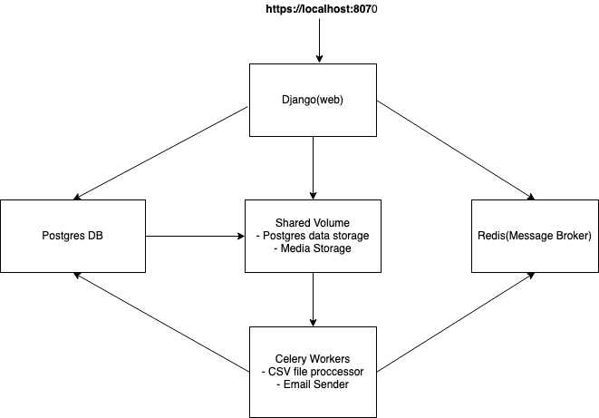

# Micro-service Architecture With Django
This code provide a set of public endpoints for creating and manipulationg ICD-10 codes.
It expose endpoints for :
- Creating new diagnosis code record.
- Edit an existing diagnosis code record.
- List diagnosis codes in batches of 20 (and paginate through the rest of the record).
- Retrieve diagnosis codes by ID.
- Delete a diagnosis code by ID.
- Uploading ICD CSV files (with ~10,000 records) containing
diagnosis code records.

## Architecture

- The email service use dummy backend so the notification is write to a local folder name 'sent_emails'.

## Technologies/Programming Languages Used
- Python.
- Django.
- Django rest framework.
- Postgres.
- Docker.

## Run Application
To run the app, execute the docker commands below:
```angular2html
chmod +x build.sh
bash build.sh

```

## Run Tests
To run the unit tests, `cd` into the project directory and run the commands below:
```angular2html
virtualenv -p python3 env
source env/bin/activate
pip install -r requirements.txt
python manage.py migrate
python manage.py test

```

# Endpoints
BASE_URL = http://localhost:8070

* To create a new diagnosis code use: 
    1. URL: `{BASE_URL}/api/v1/diagnosis_code/create/`
    2. METHOD: `POST`.
    3. DATA: ```
        {
            "category_code": "1111",
            "diagnosis_code": "1111",
            "full_code": "1111",
            "abbreviated_description": "1111",
            "full_description": "1111",
            "category_title": "1111"
        }```
        
* To edit an existing record use: 
    1. URL: `{BASE_UL}/api/v1/diagnosis_code/{id}/` 
    2. METHOD: `PUT`.
    3. DATA: ```{
            "category_code": "1111",
            "diagnosis_code": "1111",
            "full_code": "1111",
            "abbreviated_description": "1111",
            "full_description": "1111",
            "category_title": "1111"
        }```
* To list diagnosis codes use: 
    1. URL: `{BASE_UL}/api/v1/diagnosis/list/` 
    2. METHOD: `GET`.
    
* To delete a record use: 
    1. URL: `{BASE_URL}/api/v1/diagnosis_code/{id}/`, 
    2. METHOD: `DELETE`.
    
* To retrieve a record use: 
    1. URL: `{BASE_URL}/api/v1/diagnosis_code/{id}/` 
    2. METHOD: `GET`.
    
* To upload an csv file for processing use:
    1. URL: `{BASE_URL}/api/v1/diagnosis_code/csv/upload/`
    2. METHOD: `POST`
    3. DATA: ```{
        'file': {your_file},
        'user_email': {your email}
     }```
